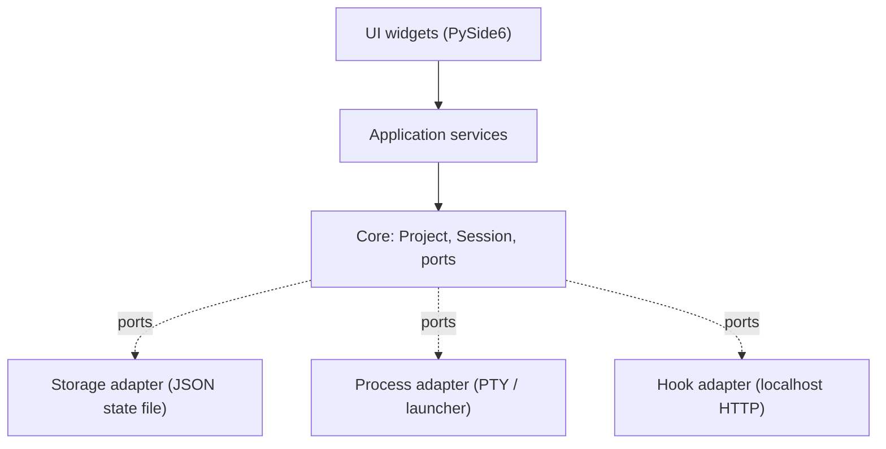

# Architecture guardrails

## Purpose

Keep TWAT's codebase layered and changeable: domain logic stays free of UI and
IO concerns, so it can be tested and evolved without dragging Qt or the
filesystem along.

## Idea

Follow Clean Architecture in the boring Python sense. Dependencies point
inward: UI → application → core. Core depends on nothing UI- or IO-specific.
Storage, process execution, and the pi lifecycle hook live behind small
adapters. Feature-driven slices touch all layers together; module-driven
scaffolding is avoided.



## Must

- Core logic MUST NOT import `PySide6` or any UI module.
- UI widgets MUST call application services, not storage, process, or hook
  internals directly.
- Storage, process execution, and the pi lifecycle hook MUST sit behind
  adapters.
- Each module MUST own one reason to change (SRP).
- Meaningful duplication MUST be removed (DRY); two similar lines do not
  justify an abstraction.
- New dependencies MUST be justified by a platform need stdlib or installed
  packages cannot meet.
- Structure MUST be feature-driven: a slice may touch UI, core, storage,
  tests, and docs together.

## Must not

- Do not create an adapter interface until there is a real second
  implementation or a test fake needs it.
- Do not add speculative settings, plugin systems, or abstractions with a
  single implementation.
- Do not let core depend on a concrete adapter; depend on the port.
- Do not build a webview to get an "Electron look".

## Acceptance criteria

- `ruff` and `mypy --strict` pass on core packages.
- No `import` from `PySide6` (or `PySide6.*`) appears under the core or app
  path (the UI layer and composition root may import Qt).
- Import-boundary check passes (see [quality-gates](./quality-gates.md)).

## Verification

```bash
uv run ruff check
uv run mypy
uv run python scripts/ci/verify_doc_guardrails.py
```

## Related docs

- [`./quality-gates.md`](./quality-gates.md)
- [`../../../CONTEXT.md`](../../../CONTEXT.md)
