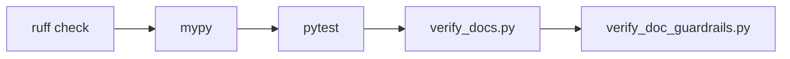

# Quality gates

## Purpose

Make the smallest relevant checks runnable locally and in CI, so a slice is
never "done" unless it is clean.

## Idea

Three gate families: formatting/linting, type checking, tests, plus a docs
guard. All run via `uv run` so the environment is identical locally and in CI.
The CI workflow (`.github/workflows/ci.yml`) runs the same commands.



## Commands (run locally)

```bash
uv sync                       # set up / update the environment
uv run ruff check             # lint + import order
uv run ruff format --check    # format check (or `uv run ruff format` to apply)
uv run mypy                   # strict types on core packages
uv run pytest                 # tests, incl. pytest-qt with QT_QPA_PLATFORM=offscreen
uv run python scripts/ci/verify_docs.py            # spec/journey link integrity + frontmatter
uv run python scripts/ci/verify_doc_guardrails.py  # import-boundary + CONTEXT.md presence
```

For headless Qt (CI or no-display machines):

```bash
QT_QPA_PLATFORM=offscreen uv run pytest
```

## Must

- Every slice MUST pass `ruff`, `mypy`, `pytest`, and both verify scripts
  before it is handed to the human for testing.
- Spec files under `docs/specs/**` MUST have frontmatter with `status` and
  `entity`.
- Internal markdown links in docs MUST resolve to existing files.
- Core code MUST NOT import `PySide6` (enforced by
  `verify_doc_guardrails.py`).

## Must not

- Do not mark a slice done with failing gates.
- Do not skip the docs check when behaviour changes.

## Acceptance criteria

- `uv run ruff check`, `uv run mypy`, `uv run pytest` all exit 0.
- `uv run python scripts/ci/verify_docs.py` exits 0.
- `uv run python scripts/ci/verify_doc_guardrails.py` exits 0.

## Verification

Run the commands above; CI runs the same set on push/PR.

## Related docs

- [`./architecture-guardrails.md`](./architecture-guardrails.md)
- [`./definition-of-done.md`](./definition-of-done.md)
