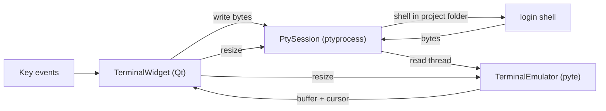

# Terminal embedding

## Purpose

Embed a real terminal inside the TWAT window (right panel) so a project's `pi`
session runs in-window, per ADR-0001. This slice proves the embedding
infrastructure with a login shell in the project folder; `pi` launch lands in a
later slice and reuses the same widget.

## Idea

A PTY (`ptyprocess`) runs the user's login shell in the selected project
folder. Its byte stream feeds a `pyte` terminal emulator (VT100/VT220/xterm),
maintaining a screen buffer with attributes. A custom Qt widget renders the
buffer (cells with fg/bg colors, attributes, cursor) and encodes key events back
to bytes written to the PTY. Resize recomputes columns/rows and resizes both the
emulator and the PTY.

## Must

- The terminal MUST run in-window (no external terminal).
- The terminal MUST run the user's login shell (`$SHELL`, fallback `/bin/bash`)
  in the selected project folder as cwd.
- Output MUST be rendered from a real terminal emulator (`pyte`), not a plain
  text box, so TUI apps (alt-screen, cursor, colors) render.
- Key input MUST be sent to the PTY as bytes (printable, Enter, Backspace, Tab,
  Escape, arrows, Ctrl combos, Home/End/Delete/PageUp/Down).
- Resizing the widget MUST resize both the emulator and the PTY.
- The PTY process MUST be terminated on close (no hidden long-running
  processes); `closeEvent` stops it.
- The process adapter and emulator MUST be Qt-free (architecture guardrail).

## Must not

- Do not launch `pi` in this slice (later slice).
- Do not use a webview.
- Do not use `qtermwidget`/C++ bindings (cross-platform packaging cost).
- Do not keep terminal state across project switches in this slice (later slice
  introduces sessions); switching projects stops the current terminal.
- Do not show unstyled output; colors and attributes come from the emulator.

## Acceptance criteria

- Selecting a project and opening a terminal shows a working shell in the
  project folder; typed commands run; output (including colors) renders.
- A simple TUI (e.g. `vim`/`htop` if available) renders using alt-screen.
- Resizing the window resizes the terminal.
- Closing the window or switching projects terminates the shell (no orphans).

## Verification

- `pytest`: `TerminalEmulator` feed/resize; `PtySession` spawn/read/write/
  terminate with `/bin/sh -c`.
- `pytest-qt`: `TerminalWidget` constructs, feeds bytes without raising, a key
  press produces bytes.
- Manual: open a terminal in a project, run `ls`, `echo $SHELL`, a color test,
  resize, switch projects, close.

## Related docs

- [`../../adr/0001-in-window-terminal-embedding.md`](../../adr/0001-in-window-terminal-embedding.md)
- [`../project/add-project.md`](../project/add-project.md)
- [`../../../CONTEXT.md`](../../../CONTEXT.md) (Launcher, Terminal panel)
