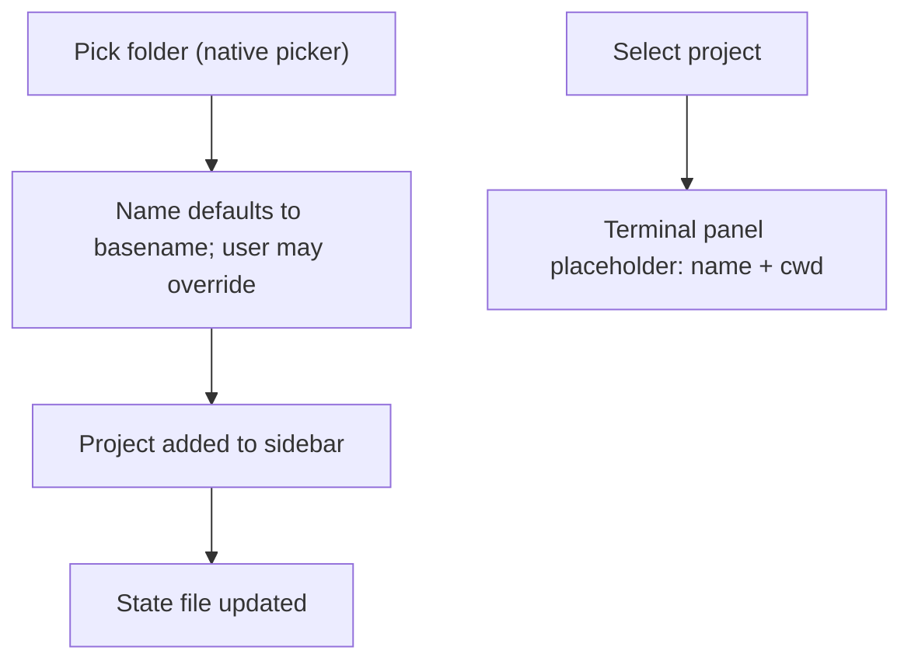

# Add project

## Purpose

Let the user register a filesystem folder as a Project so it can host `pi`
sessions with unmistakable context.

## Idea

The user picks a folder with the OS-native folder picker. The project name
defaults to the folder basename and can be overridden at creation time. The
project persists across restarts. Selecting a project shows the terminal panel
placeholder with the project name and working directory.

## Must

- Project name MUST default to the folder basename.
- The user MUST be able to override the name at creation time.
- The project MUST persist across app restart.
- Selecting a project MUST show the terminal panel placeholder with the
  project name and working directory.
- Only folders MUST be addable (the picker is a folder picker).

## Must not

- No free-text folder path entry; the native folder picker is the only entry.
- No manual session creation in this slice.
- No real terminal or `pi` launch in this slice.
- Do not add the same folder path twice; a duplicate MUST be rejected with a
  user-visible message.

## Acceptance criteria

- A project added from a folder appears in the sidebar with its (possibly
  overridden) name.
- Selecting it shows the placeholder panel with name and working directory.
- After restart, the project is still present.
- Adding an already-added folder path is rejected.

## Verification

- `pytest`: `Project` name-from-basename, name override, store round-trip.
- `pytest-qt`: add a project, see it in the sidebar, select it, see the
  placeholder.
- Manual: see [journey](../../journeys/project/add-project.md).

## Related docs

- [`../platform/persistence.md`](../platform/persistence.md)
- [`../platform/settings.md`](../platform/settings.md)
- [`../../../CONTEXT.md`](../../../CONTEXT.md)
