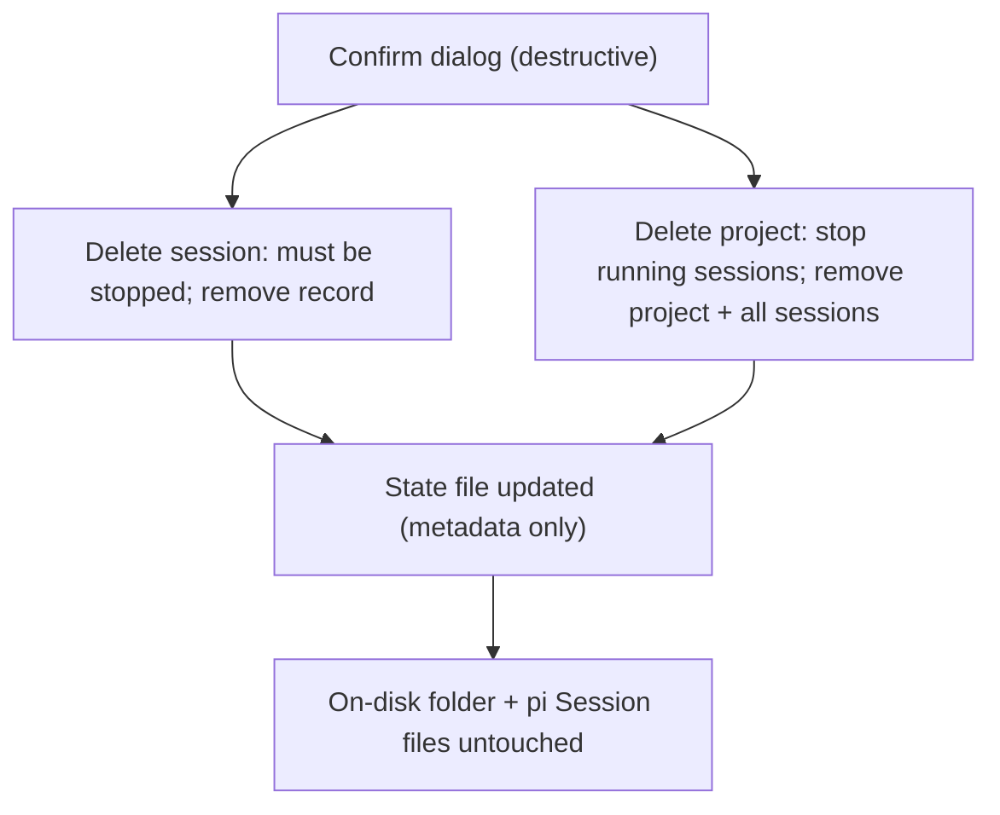

# Delete sessions and projects

## Purpose

Let the user permanently remove finished sessions and unwanted projects from
TWAT's state, keeping the sidebar clean. Deletion removes only TWAT metadata;
the on-disk folder and pi Session conversation files (owned by pi) are never
touched.

## Idea

Two destructive actions, both confirmed:

- **Delete session** — removes a stopped (almost always archived) session record
  from TWAT's state. Only allowed when the session is not running. The pi
  Session conversation file stays on disk; to get the conversation back the
  user re-resumes it via pi. A deleted session cannot be Restored (the record is
  gone).
- **Delete project** — removes a project and all of its sessions from TWAT's
  state. Any running sessions are gracefully Stopped first. The folder itself is
  untouched and can be re-added later.

Both write only TWAT's state file; no filesystem deletion, no `pi` calls.

## Must

- Delete session MUST refuse if the session is running/starting (Stop first, or
  Terminate, then Delete).
- Delete session MUST remove only the session record; the pi Session
  conversation file MUST NOT be deleted.
- Delete project MUST gracefully Stop every still-running session in it before
  removing the project and all its sessions.
- Delete project MUST NOT delete the on-disk project folder or any pi Session
  files.
- Both MUST require explicit confirmation (they are destructive and
  irreversible from TWAT's side).
- Both MUST persist (the removed records do not reappear after restart).

## Must not

- Do not delete pi Session conversation files (TWAT never owns them).
- Do not delete the project folder from disk.
- Do not allow Delete session on a running session without stopping it first.
- Do not auto-delete on Archive (Archive hides; Delete removes the record).
- Do not silently delete without a confirmation prompt.

## Acceptance criteria

- An archived/stopped session can be Deleted; it disappears from the sidebar
  and the Archive; restart does not bring it back.
- Delete on a running session is refused with a clear message.
- A project can be Deleted; it and all its sessions disappear; running sessions
  are Stopped first; restart does not bring them back.
- After Delete project, the on-disk folder still exists and the pi Session
  files are intact.
- Deleting the last session of a project leaves the (empty) project intact.

## Verification

- `pytest`: AppService delete_session (refuses running, removes record,
  preserves conversation file), delete_project (stops running sessions, removes
  project + sessions) with a fake process adapter.
- `pytest-qt`: delete buttons, confirmation gating, tree updates.
- Manual: see [journey](../../journeys/session/delete.md).

## Related docs

- [`./archive.md`](./archive.md)
- [`./lifecycle.md`](./lifecycle.md)
- [`../project/add-project.md`](../project/add-project.md)
- [`../../../CONTEXT.md`](../../../CONTEXT.md) (Delete project, Delete session)
