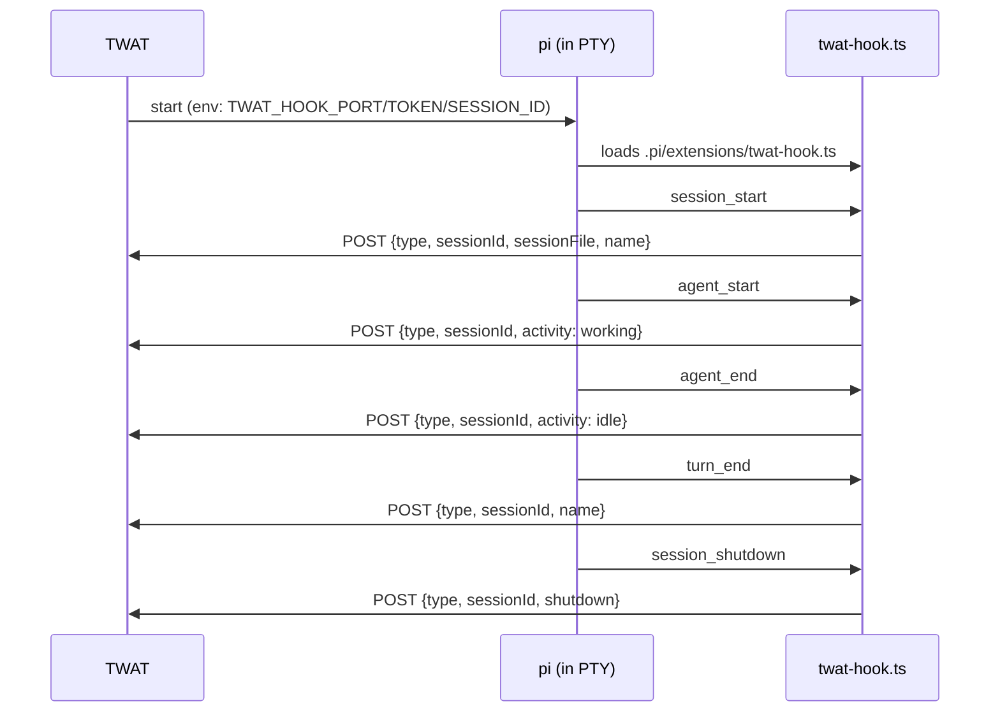

# pi lifecycle hook (twat-hook)

## Purpose

Receive real lifecycle events from `pi` running inside a session so TWAT can
record the binding (pi Session file), track agent activity, and reflect session
rename/title changes automatically.

## Idea

TWAT generates `.pi/extensions/twat-hook.ts` into each project on Start
(idempotent; versioned header; rewritten when the on-disk version differs from
the running TWAT's version). The hook reads `TWAT_HOOK_PORT`,
`TWAT_HOOK_TOKEN`, and `TWAT_SESSION_ID` from the process env at runtime (not
baked in) and POSTs lifecycle events to TWAT's localhost HTTP listener
(ADR-0002). Failures are best-effort and ignored so direct `pi` usage is never
broken.

Events TWAT consumes:
- `session_start` -> binding (session file path) + current name
- `agent_start` / `agent_end` -> agent activity `working` / `idle`
- `turn_end` -> current name (rename backstop)
- `session_shutdown` -> session exited (process ended)
- Rename: intercept pi's native `/name` via the `input` event for instant
  emission; if that does not fire for built-in commands, `/twat-rename` is the
  canonical instant path (calls `pi.setSessionName()` + emits). The live test at
  this slice decides which path is wired.

## Must

- TWAT MUST generate `.pi/extensions/twat-hook.ts` on Start if missing or if its
  `// @twat-version` header differs from the running TWAT version.
- The hook MUST read port/token/session id from env at runtime.
- TWAT MUST inject `TWAT_HOOK_PORT`, `TWAT_HOOK_TOKEN`, `TWAT_SESSION_ID` into
  each pi child env at Start.
- TWAT MUST run a localhost-only HTTP listener (auto-allocated port, per-session
  token) to receive events (ADR-0002).
- The hook MUST ignore all POST failures so direct `pi` usage is never broken.
- TWAT MUST record the binding (pi Session file) from the `session_start` event.
- TWAT MUST update the session name from hook name events; the user cannot type
  a name in TWAT.
- TWAT MUST flip agent activity to `working`/`idle` from agent events.
- TWAT MUST mark the session `exited` on `session_shutdown`.
- TWAT MUST expose a localhost `/status` endpoint (token-validated) returning
  the session's current state (id, name, state, bound file, archived, agent
  activity) so the hook's `/twat status` command can report it in the pi
  terminal.

## Must not

- Do not bake port/token into the generated file (env at runtime).
- Do not let hook failures break `pi`.
- Do not let the user rename a session manually in TWAT.
- Do not edit the user's `.gitignore`; document that the user may ignore the
  file.
- Do not fake lifecycle integration — real pi events must drive the UI.
- Do not let `/twat status` mutate state; it is read-only.
- Repair session MUST force-rewrite `twat-hook.ts` at the current TWAT version,
  gracefully Stop if running, then Start again (escape hatch for a stale hook).

## Acceptance criteria

- Starting a session generates `.pi/extensions/twat-hook.ts` in the project
  (versioned header; idempotent across starts).
- The session's binding is recorded once pi emits `session_start` (the sidebar
  reflects the pi Session file path or the name).
- Agent activity flips `working`/`idle` as the agent runs and finishes.
- Renaming via `/twat-rename` (and `/name` if the intercept fires) updates the
  sidebar session name automatically.
- Stopping pi inside the terminal (`/exit`/Ctrl+D) marks the session `exited`.
- Direct `pi` use without TWAT is not affected (hook failures are silent).

## Verification

- `pytest`: hook generator (content + version header + idempotency + rewrite on
  version mismatch); event dispatcher (token check, routes to service seams).
- Manual: see [journey](../../journeys/session/lifecycle-hook.md).

## Related docs

- [`./lifecycle.md`](./lifecycle.md)
- [`../platform/terminal-embedding.md`](../platform/terminal-embedding.md)
- [`../../adr/0002-hook-transport-localhost-http.md`](../../adr/0002-hook-transport-localhost-http.md)
- [`../../../CONTEXT.md`](../../../CONTEXT.md) (twat-hook, Hook endpoint, Rename)
