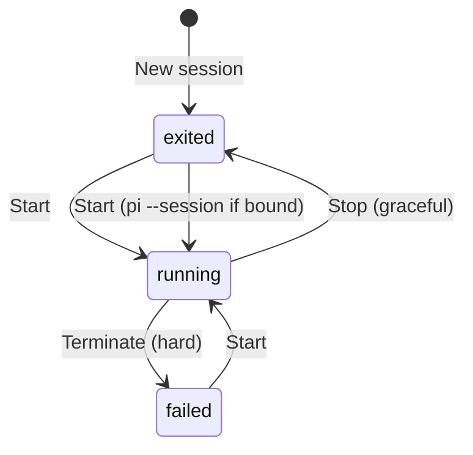

# Session lifecycle (Start/Stop/Terminate)

## Purpose

Let the user create, start, stop, and switch `pi` sessions bound to a project,
with a VM-style control surface. This slice (3a) adds the Session model and
Start/Stop/Terminate + switching; the pi lifecycle hook, agent activity,
instance lock, and app-quit dialog land in 3b+.

## Idea

A Session is a TWAT-owned runtime handle wrapping a `pi` process (see
[`../../../CONTEXT.md`](../../../CONTEXT.md): Session, Binding). The user creates a
Session (state `exited`, unbound), then Starts it: `pi` if unbound, `pi
--session <bound file>` if bound. Binding is recorded from pi (slice 4 hook); in
this slice a session stays unbound and Start always launches a fresh `pi` in the
project folder. Stop = graceful (SIGTERM), Terminate = hard (SIGKILL). Multiple
sessions can be open; switching between them shows each terminal. In this slice
the terminal is the project's login shell launching `pi` (Launcher pattern),
not a raw shell.

## Must

- A Session MUST belong to a Project and have an id, name (default), state
  (`starting`/`running`/`exited`/`failed`), and bound pi Session file (None
  until the hook reports it).
- New session MUST create a record in state `exited` without launching pi.
- Start MUST launch `pi` (via the Launcher) in the project folder and set state
  to `running`; if bound, MUST resume that pi Session file.
- Stop MUST send SIGTERM (graceful) and set state to `exited` on process exit.
- Terminate MUST send SIGKILL (hard) and set state to `failed`.
- Multiple sessions per project MUST be allowed; switching between them shows
  the selected session's terminal without losing the others (terminals kept
  alive in the background).
- Session metadata MUST persist across restart (id, name, project, state,
  bound file).

## Must not

- Do not auto-launch pi on New session (the user Starts explicitly).
- Do not kill a session when switching away (only Stop/Terminate/close quit it).
- Do not rename sessions manually in TWAT (names come from pi; slice 4).
- Do not fake the binding — until the hook reports it, `bound_file` is None and
  Start launches a fresh `pi`. (Slice 4 wires the hook.)

## Acceptance criteria

- New session appears under its project in the sidebar, state `exited`.
- Start launches `pi` in the project folder; the terminal shows pi's TUI; state
  becomes `running`.
- Stop ends pi gracefully; state `exited`; the terminal shows pi exited.
- Terminate ends pi hard; state `failed`.
- A second session can be created and started; switching back to the first shows
  its still-running terminal.
- Restart preserves session metadata (sessions are `exited` after restart since
  their processes did not survive).

## Verification

- `pytest`: Session model state transitions; AppService add/list/start/stop/
  terminate (with a fake process adapter so no real pi in CI).
- Manual: see [journey](../../journeys/session/start-stop.md).

## Related docs

- [`../project/add-project.md`](../project/add-project.md)
- [`../platform/terminal-embedding.md`](../platform/terminal-embedding.md)
- [`../../../CONTEXT.md`](../../../CONTEXT.md) (Session, Binding, Start/Stop/Terminate)
